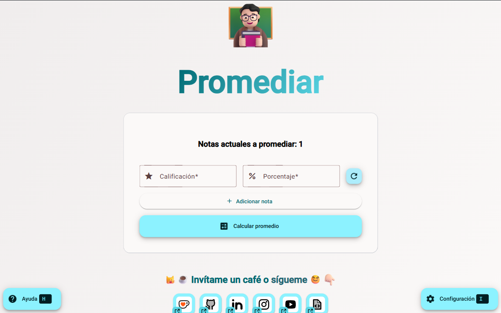

# Promediar

 

Promediar es una aplicación que te permite calcular el promedio de tus calificaciones de una forma rápida y sencilla.

## Características

✅ Características completadas
❌ Características pendientes

- ✅ Calcula el promedio de tus calificaciones.
- ✅ Permite cambiar la configuración de tus notas.
- ✅ Calcula cuánto necesitas en tu próxima nota para pasar la materia.
- ❌ Guarda tus notas en el almacenamiento local para evitar perderlas al cerrar la aplicación.
- ❌ Exportar promedio a un archivo de texto.
- ❌ Importar promedio desde un archivo de texto.
- ❌ Exportar como imagen el promedio.

## Capturas de pantalla

## Tecnologías

- [Angular](https://angular.dev/) (^19.0.0)
- [TypeScript](https://www.typescriptlang.org/) (~5.5.2)
- [Angular Material](https://material.angular.io/) (^19.0.0)

## Instalación

1. Clona el repositorio.
2. Instala las dependencias con `npm install`.
3. Inicia la aplicación con `npm start`.
4. Abre tu navegador y ve a `http://localhost:4200`.
5. ¡Listo!

## Licencia

Este proyecto puede ser utilizado por cualquier persona para uso personal y no comercial. No se permite la venta de este proyecto ni su uso en productos de pago sin el consentimiento del [autor](mailto:mrnizzy@proton.me).
